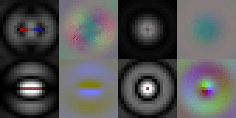

# Electromagnetic Field Simulator

A 3D FDM electromagnetic solver with real-time visualization. Inputs into the simulation are time-varying charge density and current density fields. Boundaries are absorbing. A CPU implementation (NumPy) and a GPU implementation (PyCUDA) are available.

This is a work in progress. Currently the CUDA implementation only follows Gauss's and Ampere's laws. NumPy implementation is complete, but unverified.



*An incomplete simulation of a dipole radiator*


## Usage

Refer to `example.py` for a concrete example that was used to render the simulation shown above.

### Solver

1. Create an EM field domain 

```python
from src import emfield

field = emfield.Field(
    size,       # Grid size [x size, y size, z size],
    scale,      # Spatial resolution
    timestep,   # Time resolution
    compute     # Solver implementation, "numpy" or "cuda"
)
```

2. Modify the charge density and current density fields

```python
field.charge_density[...] = 0   # 3D scalar field,
                                # NumPy array (x size, y size, z size)

field.current_density[...] = 0  # 3D vector field,
                                # NumPy array (x size, y size, z size, 3)
```

3. Compute a simulation time step

```python
field.update()
```

4. Retrieve resulting E and B fields
```python
E_field = field.efield[1, ...]  # 3D vector field,
                                # NumPy array (x size, y size, z size, 3)

B_field = field.bfield[1, ...]  # 3D vector field,
                                # NumPy array (x size, y size, z size, 3)

# efield[0, ...] and bfield[0, ...] contain the previous values
# of the fields
```


### Visualization

1. Create a window

```python
from src import gui, fieldvis

window = gui.Window(
    size    # Size in pixels [width, height]
)
```

2. Create a visualizer instance

```python
visualizer = fieldvis.FieldVisualizer(
    field   # EM field domain
)
```

3. Clear the window

```python
window.fill(
    color=[0, 0, 0] # Integer color values from 0 to 255 [R, G, B]
)
```

4. Render a slice of the domain into a 2D pixel array

```python
array = visualizer.eFieldRgb(
    index,      # Index (depth) of the desired 2D slice
    axis,       # Axis along which to slice (0: x, 1: y, 2: z)
    intensity   # Brightness scale
    )
```

5. Draw the array onto the window

```python
window.drawArray(
    array,      # 2D pixel array
    size,       # Scale of the drawn array as a factor of window size
                # from 0 to 1 [x scale, y scale]
    position    # Position of the drawn array as a factor of window size
                # from 0 to 1 [x position, y position]
)
```

6. Throttle the refresh rate

```python
window.sleep(
    fps # Desired frames per second (or slower if simulation cannot keep up)
)
```

6. Refresh the window

```python
# Boolean, False if exit button was pressed, True otherwise
app_continue = window.update()
```

7. Close the window

```python
window.close()
```


### Available visualization functions

| Function | Description | Formula|
|-|-|-|
| FieldVisualizer.eFieldRgb | E (vector) field | R,G,B = intensity * X,Y,Z |
| FieldVisualizer.bFieldRgb | B (vector) field | R,G,B = intensity * X,Y,Z |
| FieldVisualizer.eFieldMagnitude | E magnitude (scalar) field | R=G=B =  intensity * \|X,Y,Z\| |
| FieldVisualizer.bFieldMagnitude | B magnitude (scalar) field | R=G=B =  intensity * \|X,Y,Z\| |
| FieldVisualizer.chargeDensity | Charge density (scalar) field | R = intensity * \|X\| * (X > 0)<br/> G = 0 <br/> B = intensity * \|X\| * (X < 0) |
| FieldVisualizer.currentDensity | Current density (vector) field | R,G,B = intensity * X,Y,Z |
| FieldVisualizer.chargeDensityTransparent | Charge density (scalar) field | R = (X > 0) <br/> G = 0 <br/> B = (X < 0) <br/> A = intensity * \|X\| |
| FieldVisualizer.currentDensityTransparent | Current density (vector) field | R,G,B = X,Y,Z / \|X,Y,Z\| <br/> A = intensity * \|X,Y,Z\| |